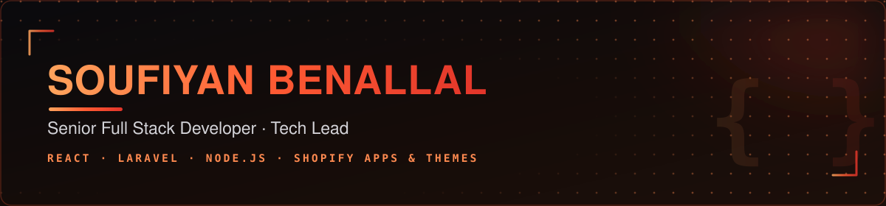

  

  

 

##  About Me

I'm a **Senior Full Stack Developer & Technical Lead** with **7+ years of experience** building and scaling web applications, Shopify apps/themes, and SaaS products — leading engineering teams, defining technical architecture and product roadmaps, and shipping AI-driven features into production.

 Currently **Lead Full Stack Developer** at **Ader Solutions**, Morocco — building SaaS products, automations, and AI-integrated tools using **React, Laravel, Node.js**, and the **Shopify Apps & Themes** ecosystem.
 
 Deep specialization in **React, Laravel, Node.js, and Shopify Apps & Themes** development.
 
 Based in Meknes, Morocco — experienced collaborating with distributed, remote teams.
 
 Arabic (Native) &#183; English (Professional) &#183; French (Limited)

 

##  Core Expertise

 **7+ years** of professional full stack development
 
 **Technical leadership** — roadmap, architecture, mentoring engineering teams
 
 **Shopify ecosystem** — Apps, Themes (Liquid, OS 2.0), Functions & Extensions
 
 **AI-driven features & automation** integrated into production systems
 
 **Full stack delivery** across React, Laravel and Node.js
 
 **CI/CD & Agile/Scrum** across distributed, cross-functional teams

 

##  Tech Stack

**Main Frontend Stack**

**Main Backend Stack**

**Commerce**

**Additional Tools & Platforms**

 

##  Experience

<table>
<tr><td><b>Lead Full Stack Developer</b> — Ader Solutions</td><td align="right"><i>Jan 2023 – Present</i></td></tr>
<tr><td colspan="2">Defining tech strategy & product roadmap · leading and mentoring the engineering team · designing scalable architecture · driving SaaS, automation and AI-integrated product innovation.</td></tr>
<tr><td colspan="2"> </td></tr>
<tr><td><b>Full Stack Engineering Developer (Remote)</b> — Le Ventures, USA</td><td align="right"><i>Nov 2020 – Jan 2023</i></td></tr>
<tr><td colspan="2">Built Shopify apps, custom themes & SaaS products · React/TypeScript frontends · Node.js & Laravel backends · Agile collaboration with a remote US team.</td></tr>
<tr><td colspan="2"> </td></tr>
<tr><td><b>Full Stack Developer (Part-time)</b> — FORNET MAROC</td><td align="right"><i>Nov 2020 – May 2021</i></td></tr>
<tr><td colspan="2">Scalable APIs & responsive interfaces using React, TypeScript, Node.js and Laravel — concurrent with the Le Ventures role.</td></tr>
<tr><td colspan="2"> </td></tr>
<tr><td><b>Frontend Developer</b> — ARA Systèmes & Technologie</td><td align="right"><i>Nov 2019 – Aug 2020</i></td></tr>
<tr><td colspan="2">Built a restaurant/café management app and an SPA dashboard & delivery app, both backed by Firebase.</td></tr>
<tr><td colspan="2"> </td></tr>
<tr><td><b>Full Stack Engineer</b> — Morrocow3</td><td align="right"><i>Jun 2018 – Oct 2019</i></td></tr>
<tr><td colspan="2">Custom business platforms with Laravel, PHP, JavaScript & MySQL — REST API integrations for client-tailored solutions.</td></tr>
</table>

 

##  Education

- **Master's Degree, Computer Science** — Jiangsu University of Science and Technology *(2023 – 2025)*
- **B.Tech, Web/Multimedia Management & Webmaster** — Ibn Tofaïl University, Kénitra *(2019 – 2020)*
- **DTS, Information Technology** — Specialized Institute of Applied Technology, Bab Tizimi *(2015 – 2018)*

 

##  GitHub Stats

 

 

##  Let's Connect

  

